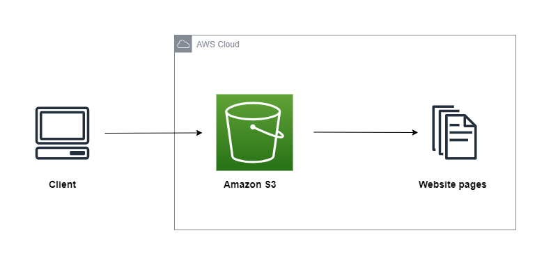
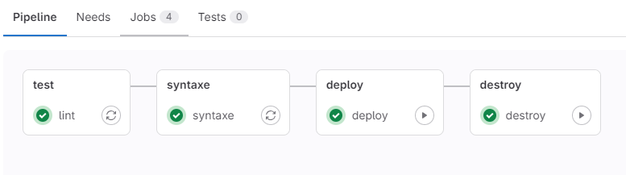

# GitLab CI + Terraform : Create a static website using Amazon S3

The aim of this project is to automate the deployment of a static website on Amazon S3.

## Infrastructure



## Tools

The following tools were used for this project:

- [ ] [GitLab CI/CD](https://docs.gitlab.com/ee/topics/build_your_application.html), is a GitLab feature that lets you set up CI/CD pipelines. We used Gitlab CI/CD to manage the infrastructure deployment pipelines.
- [ ] [Terraform ](https://developer.hashicorp.com/terraform/docs), automates the provisioning of Cloud resources. We used Terraform to provision the bucket that will host the static website.
- [ ] [Amazon S3](https://docs.aws.amazon.com/AmazonS3/latest/userguide/Welcome.html), is a storage service. Amazon S3 is used to host static website pages.

## Setup

1. **Create the bucket S3 for Terraform**

For this project, we first need to create an S3 bucket that will contain the file summarizing the state of the infrastructure provisioned by Terraform. Once the bucket has been created, replace `<your-bucket-terraform-backend>` by the name of the bucket created in the file [backend.tf](./backend.tf#L11).

```
  backend "s3" {
    region = "us-east-1"
    bucket = "<your-bucket-terraform-backend>"
    key    = "terraform.tfstate"
  }
```

2. **Set the bucket name for website**

In the file [variables.tf](./variables.tf#L8), replacee `<your-bucket-website>` by the name of the bucket that will host the static website pages.

```
  variable "website_bucket_name" {
    type    = string
    default = "<your-bucket-website>"
  }
```

3. **Configure GitLab**

In the GitLab project, add the variables **AWS_ACCESS_KEY_ID** and **AWS_SECRET_ACCESS_KEY** on the page _"Settings > CI/CD > Variables"_. These variables will enable Terraform to authenticate and communicate with AWS services to provision the infrastructure.

4. **Deployment**

To deploy the infrastructure, run the job **deploy** on the GitLab pipeline.



The job **destroy** is run at the end if you want to delete all resources provisioned by terraform on the AWS cloud.
